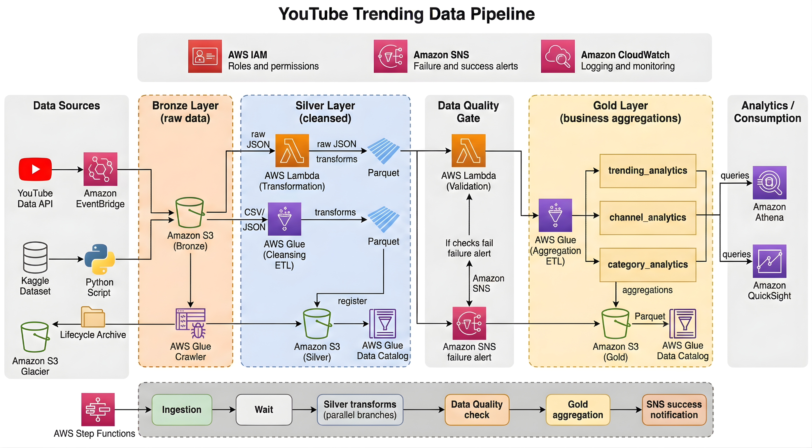

# YouTube Trending Data Pipeline

End-to-end AWS data engineering pipeline using a Bronze, Silver, and Gold data lake architecture.

## Architecture

## Flow

YouTube Data API / Kaggle
→ Bronze S3
→ Silver transformations
→ Data Quality validation
→ Gold aggregations
→ Athena analytics

The pipeline is orchestrated using AWS Step Functions.

## AWS Services

- Amazon S3
- AWS Lambda
- AWS Glue
- AWS Glue Data Catalog
- Amazon Athena
- AWS Step Functions
- Amazon SNS
- Amazon CloudWatch
- AWS IAM

## Data Layers

Bronze:
- raw YouTube API JSON
- raw Kaggle CSV
- raw Kaggle reference JSON

Silver:
- api_statistics
- kaggle_statistics
- kaggle_reference_data

Gold:
- trending_analytics
- channel_analytics
- category_analytics

## Data Quality

The Data Quality Lambda runs Athena checks against the Silver layer.

Checks include:
- row counts
- null values
- negative metrics
- missing regions
- duplicate records

The pipeline only proceeds to Gold when validation passes.

## Orchestration

AWS Step Functions runs:

Ingestion
→ Wait
→ Parallel Silver transforms
→ Data Quality
→ Gold transformation
→ SNS notification

## Project Status

End-to-end pipeline successfully completed and validated in AWS.

AWS Region: `ap-southeast-2`